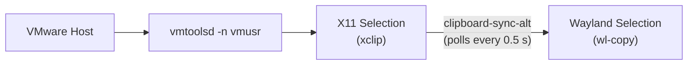

I run CachyOS as a daily-driver VMware VM on a Linux host.
One of the first things I noticed: clipboard sharing between host and guest just... doesn't work.
You press Ctrl+C on the host, Ctrl+V in the guest — nothing.
The other direction? Also nothing.

`open-vm-tools` is supposed to handle this, and it does — if you're running X11.
On a Wayland guest, it has no idea what to do.
There's no native Wayland support, and the clipboard plugin simply can't find a selection buffer to talk to.

This post documents the bridge I ended up building.
It's not elegant, but it's reliable, and it fixes an annoying file-descriptor leak along the way.

## How the pieces fit

The core problem is that `open-vm-tools` clipboard support targets X11.
On a Wayland desktop, X11 and Wayland each maintain their own selection buffers — they're completely separate.
So we need two things: a VMware daemon that talks to X11, and a script that keeps X11 and Wayland in sync.



You copy on the host, vmtoolsd receives it via the hypervisor and writes it to the X11 clipboard, then `clipboard-sync-alt` polls for changes and pushes them into the Wayland selection.


The reverse direction is event-driven: `wl-paste --watch` fires whenever the Wayland selection changes, pipes it into the X11 clipboard, and vmtoolsd forwards it to the host via the hypervisor.

Everything runs as user-level systemd services tied to `graphical-session.target`.
That way nothing starts before the desktop is ready, and it all shuts down cleanly on logout.

## Step 1 — Install packages

```bash
sudo pacman -S open-vm-tools gtkmm3 wl-clipboard cliphist xclip
sudo systemctl enable --now vmtoolsd
```

Five packages:

| Package | Why you need it |
|---|---|
| `open-vm-tools` | VMware guest drivers — clipboard, resolution, mouse integration |
| `gtkmm3` | Required for full open-vm-tools functionality (dialog boxes, drag-and-drop UI) |
| `wl-clipboard` | Provides `wl-copy` and `wl-paste` for reading/writing Wayland selections |
| `xclip` | Read and write X11 selections (the bridge needs both sides) |
| `cliphist` | Optional — persists clipboard history across Wayland restarts |

The system-level `vmtoolsd` service handles resolution and mouse integration out of the box.
The *user-level* service (next step) is what actually makes clipboard work.

## Step 2 — VMware user daemon with clipboard support

The VMware clipboard plugin (`libdndcp.so`) expects a running X11 display.
On a Wayland guest, it won't find one unless you explicitly point it at XWayland.
I spent a while assuming `open-vm-tools` would "just work" after installing it — it doesn't.
The system service runs fine, but clipboard silently does nothing without the user daemon configured correctly.

Create **`~/.local/bin/vmware-clipboard-wrapper`**:

```bash
#!/bin/bash
export DISPLAY=:0
export GDK_BACKEND=x11
export CLUTTER_BACKEND=x11
pkill -f "vmtoolsd -n vmusr" >/dev/null 2>&1
sleep 1
while ! test -S /tmp/.X11-unix/X0; do sleep 0.5; done
exec /usr/bin/vmtoolsd -n vmusr -p /usr/lib/open-vm-tools/plugins/vmusr
```

Each line is there for a reason:

- `DISPLAY=:0` and the `*_BACKEND=x11` exports force the daemon to talk to XWayland instead of trying (and failing) to connect to a native Wayland compositor.
- The `pkill` cleans up any stale instance from a previous session. systemd's `Restart=always` can race on logout and leave a zombie behind.
- The `-p` flag is critical — it tells `vmtoolsd` where to find its user plugins, including `libdndcp.so`. **Without this flag, VM-to-host clipboard will not work at all.** This was my second dead end: everything looked correct, but the `-p` flag was missing.
- The `while` loop waits for the X11 socket to appear. Without it, the daemon can start before the display is ready and fail silently.

Wrap it in a systemd service at **`~/.config/systemd/user/vmtoolsd-user.service`**:

```ini
[Unit]
Description=VMware User Tools (clipboard, resolution, mouse integration)
PartOf=graphical-session.target
After=graphical-session.target
Requisite=graphical-session.target

[Service]
Type=simple
ExecStart=%h/.local/bin/vmware-clipboard-wrapper
Restart=always
RestartSec=5
LimitNOFILE=65536

[Install]
WantedBy=graphical-session.target
```

Enable it:

```bash
chmod +x ~/.local/bin/vmware-clipboard-wrapper
systemctl --user daemon-reload
systemctl --user enable --now vmtoolsd-user.service
```

After this step, host-to-VM clipboard works — text copied on the host appears in the X11 selection inside the guest.
VM-to-host still won't work until the next step bridges X11 into Wayland.

## Step 3 — X11 to Wayland clipboard sync

This is the missing link.
`vmtoolsd` writes to the X11 clipboard.
Your Wayland apps read from the Wayland clipboard.
These are two separate selection buffers that know nothing about each other.

The sync script is short but does two things in parallel:

- **Wayland to X11**: `wl-paste --watch` fires a callback every time the Wayland selection changes. Each change gets piped into `xclip -i` to update the X11 clipboard. This direction is event-driven — no polling needed.
- **X11 to Wayland**: There's no equivalent event API for X11, so we poll every 0.5 seconds. If the X11 clipboard content changes and isn't empty, it gets piped into `wl-copy`.

Create **`~/.local/bin/clipboard-sync-alt`**:

```bash
#!/bin/bash
export DISPLAY=:0

# Wayland → X11: push every new Wayland selection into the X11 clipboard
wl-paste --watch xclip -selection clipboard -i 2>/dev/null &
WAYLAND_PID=$!

# X11 → Wayland: poll the X11 clipboard and push changes into Wayland
PREV=""
while true; do
    CUR=$(xclip -selection clipboard -o 2>/dev/null || true)
    if [ "$CUR" != "$PREV" ] && [ -n "$CUR" ]; then
        printf '%s' "$CUR" | wl-copy
        PREV="$CUR"
    fi
    sleep 0.5
done &
X11_PID=$!

cleanup() { kill $WAYLAND_PID $X11_PID 2>/dev/null; exit 0; }
trap cleanup EXIT INT TERM
wait
```

The `cleanup` trap makes sure both background processes are killed when systemd stops the service.

Wire it up at **`~/.config/systemd/user/clipboard-sync-alt.service`**:

```ini
[Unit]
Description=Wayland <-> X11 clipboard sync
PartOf=graphical-session.target
After=graphical-session.target
Requisite=graphical-session.target

[Service]
Type=simple
ExecStart=%h/.local/bin/clipboard-sync-alt
Restart=on-failure

[Install]
WantedBy=graphical-session.target
```

Enable it:

```bash
chmod +x ~/.local/bin/clipboard-sync-alt
systemctl --user enable --now clipboard-sync-alt.service
```

Clipboard should now work in both directions.

## Step 4 — Periodic restart (working around an FD leak)

Here's the part that drove me nuts.
Everything would work perfectly after a fresh boot, and then — hours later — copying from the VM to the host would silently stop working.
Host-to-VM usually kept going. It was always VM-to-host that died first.

The culprit: `vmtoolsd -n vmusr` leaks file descriptors over time.
Once enough FDs are gone, the clipboard channel breaks.

The pragmatic fix is to restart the user service every 5 minutes.
The interruption is barely noticeable — any active clipboard content gets re-synced within half a second.
I ran this setup for a while without the restart timer, constantly manually restarting the service when clipboard died.
That got old fast.

Create **`~/.config/systemd/user/vmtoolsd-user-restart.timer`**:

```ini
[Unit]
Description=Periodic restart of VMware User Tools (prevents FD leak)

[Timer]
OnBootSec=5min
OnUnitActiveSec=5min
Persistent=true

[Install]
WantedBy=timers.target
```

Create **`~/.config/systemd/user/vmtoolsd-user-restart.service`**:

```ini
[Unit]
Description=Restart VMware User Tools to clear FD leak
PartOf=graphical-session.target

[Service]
Type=oneshot
ExecStart=/usr/bin/systemctl --user restart vmtoolsd-user.service
```

Enable the timer:

```bash
systemctl --user enable --now vmtoolsd-user-restart.timer
```

If clipboard breaks between restarts (rare, but it happens), a quick manual restart fixes it:

```bash
systemctl --user restart vmtoolsd-user.service
```

## Step 5 — Cliphist (optional)

If you use a launcher like `rofi` or `wofi` with `cliphist`, you'll want a service to persist clipboard history.
This is unrelated to the VMware problem — it's just a nice Wayland quality-of-life addition.

Create **`~/.config/systemd/user/cliphist.service`**:

```ini
[Unit]
Description=Wayland clipboard history
PartOf=graphical-session.target
After=graphical-session.target
Requisite=graphical-session.target

[Service]
Type=simple
ExecStart=/usr/bin/wl-paste --watch cliphist store
Restart=on-failure

[Install]
WantedBy=graphical-session.target
```

```bash
systemctl --user enable --now cliphist.service
```

## Troubleshooting

| Symptom | Likely cause | Fix |
|---|---|---|
| Host to VM doesn't work at all | `vmtoolsd -n vmusr` isn't running | `systemctl --user status vmtoolsd-user.service` |
| VM to host doesn't work at all | Missing `-p` flag (no `libdndcp.so` loaded) | Check the wrapper script has the `-p` line |
| Clipboard works at boot, then stops | FD leak in `vmtoolsd` | Confirm the restart timer is enabled: `systemctl --user list-timers` |
| Wayland apps can't receive copies | `clipboard-sync-alt` isn't running | `systemctl --user status clipboard-sync-alt.service` |
| X11 apps can't receive copies | `clipboard-sync-alt` isn't running, or `DISPLAY=:0` is wrong | Check `echo $DISPLAY` in a terminal and adjust the script |

## Closing remarks

This is a workaround, not a real fix.
The proper solution is for `open-vm-tools` to gain native Wayland clipboard support, which would eliminate the need for the X11 bridge entirely.
Until that happens, this setup has been running reliably on my daily-driver VM for weeks with no issues beyond the FD leak (which the timer handles transparently).

The biggest gotcha was the `-p` flag on `vmtoolsd` — without it, the clipboard plugin doesn't load and VM-to-host copy silently does nothing.
The second biggest gotcha was the FD leak, which manifests as "clipboard works after reboot, then mysteriously stops" and is easy to confuse with a configuration problem.